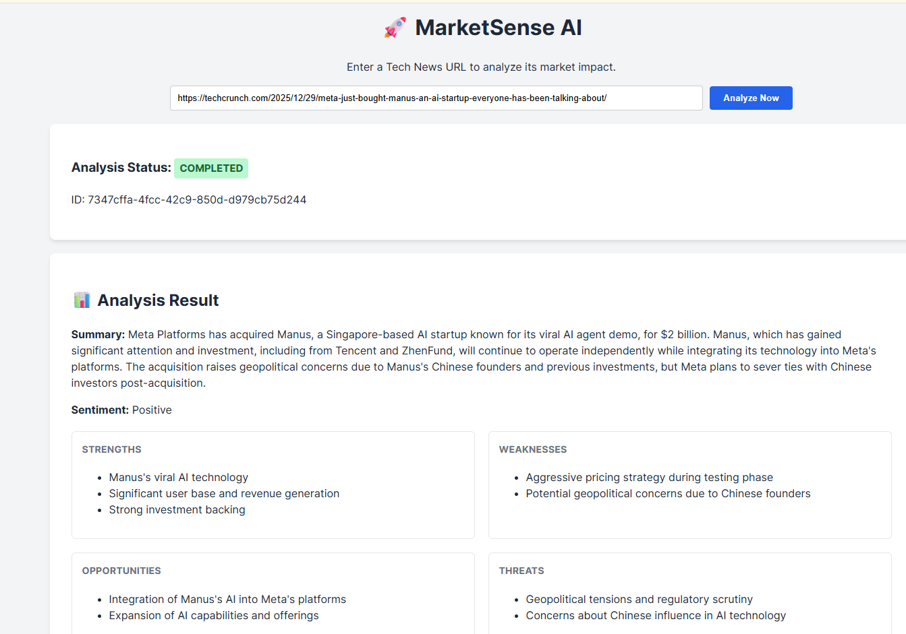
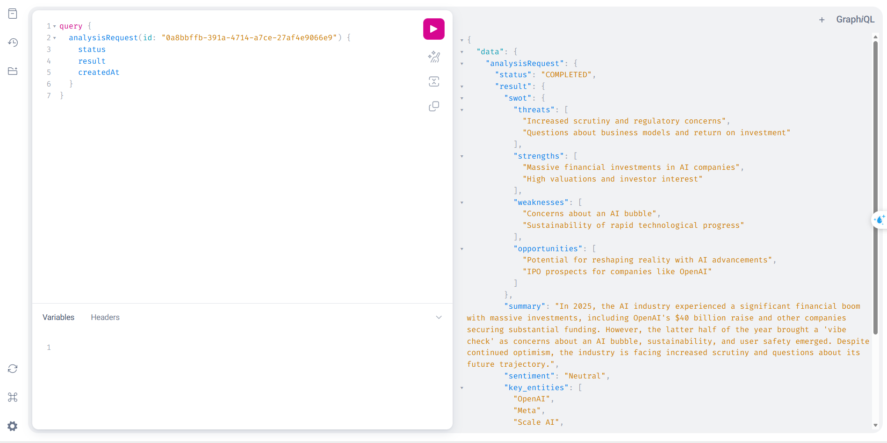
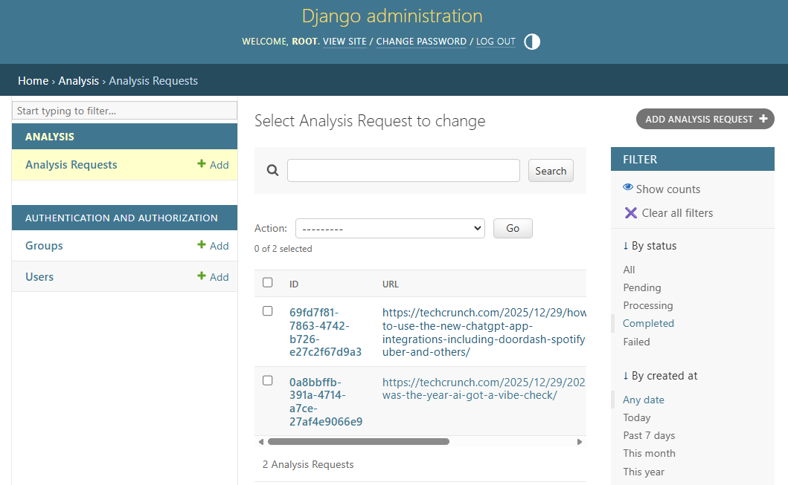

# 🚀 MarketSense AI - Intelligent Market Research Agent (POC)

**Portfolio Project:** A Proof of Concept (POC) demonstrating Full-stack Architecture, Asynchronous System Design, and LLM Integration.

MarketSense AI is an end-to-end intelligent system designed to automate the extraction and analysis of market intelligence from web resources. It leverages a Hybrid Architecture combining a robust Django monolith for orchestration and a high-performance FastAPI microservice for AI inference.

## 🎬 Demo

<p align="center">
<video src="/assets/Demo.mp4" controls width="800"></video>
</p>


### Screenshots

<p align="center">
  
</p>

<p align="center">
  
</p>

<p align="center">
  
</p>

## 📖 Table of Contents

- [Project Context & Objective](#-project-context--objective)
- [System Architecture](#️-system-architecture)
- [Technical Highlights (Architecture Decisions)](#-technical-highlights-architecture-decisions)
- [Tech Stack](#️-tech-stack)
- [Key Features](#-key-features)
- [Getting Started](#-getting-started)
- [Installation](#installation)
- [Access Points](#access-points)
- [Project Structure](#-project-structure)
- [Future Improvements](#-future-improvements)
- [Author](#-author)

## 🎯 Project Context & Objective

This project was built to showcase a production-ready approach to modern AI web applications. The primary goals of this POC are:

- **Decoupling Concerns:** Separating business logic (Django) from compute-intensive AI tasks (FastAPI).
- **Resilience:** Implementing robust asynchronous processing for long-running tasks (Web Scraping + LLM Inference).
- **Type Safety:** Ensuring data integrity from Database to Frontend using GraphQL and TypeScript.

## 💡 Technical Highlights (Architecture Decisions)

**Why this architecture?** A breakdown of the engineering choices made during development.

1. **Hybrid Monolith + Microservice Pattern**
   - **Orchestrator (Django):** Handles auth, data modeling, and standard CRUD. Django was chosen for its mature ecosystem and rapid development speed.
   - **Intelligence (FastAPI):** Handles AI inference. Python's asyncio in FastAPI is superior for I/O-bound operations (calling OpenAI APIs) compared to synchronous Django, allowing independent scaling of the AI worker nodes.

2. **Event-Driven & Async (Celery + Redis)**
   - Analyzing a long market report can take 10-30 seconds, which would timeout a standard HTTP request.
   - **Solution:** The system uses a strictly asynchronous flow. The API responds instantly with a **PENDING** status (via GraphQL). The Frontend polls for completion. This ensures a responsive UI regardless of backend processing time.

3. **Structured Outputs & Hallucination Control**
   - **Technique:** To prevent the LLM from returning unstructured chatter, the AI Service uses Pydantic to enforce strict output schemas.
   - **Result:** The frontend is guaranteed to receive valid JSON for the SWOT analysis and Sentiment data, or the system will automatically retry/fail gracefully.

## 🏗️ System Architecture

### High-Level Design

**Design Methodology: ICONIX Process**
- **Domain Modeling:** Core entities (AnalysisRequest, SWOT, Sentiment).
- **Use Case Analysis:** "Analyze URL" flow with robustness analysis (handling timeouts, scraping failures).
- **Sequence Design:** Mapping asynchronous interactions between User, Django, Celery, and FastAPI.
## 🛠️ Tech Stack

### Backend Core (Orchestrator)
- **Python & Django:** Core application logic and ORM.
- **Graphene-Django:** GraphQL API for flexible data querying.
- **Celery:** Distributed task queue.
- **Redis:** Message broker and result backend.
- **PostgreSQL:** Relational DB with JSONB support.

### AI Microservice (Intelligence)
- **FastAPI:** Async framework for AI endpoints.
- **OpenAI API:** LLM for semantic analysis.
- **Pydantic:** Data validation and schema enforcement.

### Frontend (Client)
- **React (Vite):** Frontend build tool.
- **TypeScript:** Type safety.
- **Apollo Client:** State management and GraphQL integration.

## ✨ Key Features

- 🕷️ **Automated Web Scraping:** Extracts clean text from technical articles/reports.
- 🧠 **Structured AI Analysis:** Generates strict JSON outputs (SWOT, Sentiment).
- ⚡ **Non-blocking UI:** Asynchronous processing with polling mechanisms.
- 📊 **GraphQL API:** Efficient data fetching.
- 🛡️ **Robust Error Handling:** Retries for scraping and AI timeouts.

## 🚀 Getting Started

This project is containerized for easy setup.

### Prerequisites
- Docker & Docker Compose installed.
- An OpenAI API Key.


## Installation

### 1. Clone the repository

```bash
git clone https://github.com/ninhhv0012/market-sense-ai.git
cd market-sense-ai
```

### 2. Configure Environment Variables

Create a `.env` file in the root directory:

```bash
# Database
POSTGRES_DB=marketsense_db
POSTGRES_USER=postgres
POSTGRES_PASSWORD=postgres_secret
DB_HOST=db
DB_PORT=5432

# Redis
REDIS_URL=redis://broker:6379/0

# AI Service
OPENAI_API_KEY=sk-your-openai-api-key-here
AI_SERVICE_URL=http://ai_service:8000
```

### 3. Build and Run

```bash
docker-compose up --build
```

### 4. Run Migrations

Open a new terminal tab:

```bash
docker-compose exec backend_core python manage.py migrate
```

### 5. Start Frontend (Run locally for better DevX)

```bash
cd frontend
npm install
npm run dev
```

## Access Points

- **Frontend UI:** `http://localhost:5173`
- **GraphQL Playground:** `http://localhost:8000/graphql`
- **FastAPI Swagger Docs:** `http://localhost:8001/docs`

## 📂 Project Structure

```
market-sense-ai/
├── backend_core/            # Django Monolith (Orchestrator)
│   ├── analysis/            # Business logic (Models, Tasks, Scraper)
│   ├── core/                # Project settings, Celery config, Schema
│   └── Dockerfile
├── ai_service/              # FastAPI Microservice
│   ├── app/                 # AI logic, Prompt Engineering, Pydantic Models
│   └── Dockerfile
├── frontend/                # React + TypeScript Client
├── docker-compose.yml       # Service Orchestration
└── README.md
```

## 🔮 Future Improvements

Since this is a POC, several production-grade features are planned:

- [ ]  **Real-time Updates:** Migrate from polling to WebSockets (Django Channels).
- [ ]  **RAG Implementation:** Add a vector database (Pinecone/Milvus) for Chat-with-PDF functionality.
- [ ]  **Cloud Deployment:** Deploy to AWS ECS (Fargate) with CI/CD pipelines.

## 👤 Author

**[Your Name]**

- **Portfolio:** [Link to your portfolio]
- **LinkedIn:** [Link to your LinkedIn]
- **Email:** [Your Email]